# WSL Dashboard

<p align="center">
  
</p>

Usa ka moderno, high-performance, gaan ug ubos ang memory usage nga dashboard sa pagdumala sa WSL (Windows Subsystem for Linux) instances. Gitukod gamit ang Rust ug Slint, naghatag ug labing maayong native nga kasinatian.

---

```diff
Pahibalo:

- Ang WSL Dashboard wala gipanghatag pinaagi sa Microsoft Store.
- Bisan unsang aplikasyon nga gilista didto uban sa ngalan nga "WSL Dashboard" wala giuyonan ug mahimong peke.
- Palihug ayaw kini i-download aron malikayan ang posibleng mga pagpanglimbong.
```

---

<p align="left">
  <a href="https://www.rust-lang.org" target="_blank"></a>
  <a href="https://slint.dev" target="_blank"></a>
  <a href="https://tokio.rs" target="_blank"></a>
  <a href="https://github.com/microsoft/windows-rs" target="_blank"></a>
  <a href="../LICENSE"></a>
  <a href="https://hellogithub.com/repository/owu/wsl-dashboard" target="_blank"></a>
</p>

I18N :  [English](../README.md) | [简体中文](./README_zh_CN.md) | [繁體中文](./README_zh_TW.md) | [हिन्दी](./README_hi.md) | [Español](./README_es.md) | [Français](./README_fr.md) | [العربية](./README_ar.md) | [বাংলা](./README_bn.md) | [Português](./README_pt.md) | [Русский](./README_ru.md) | [اردو](./README_ur.md) | [Bahasa Indonesia](./README_id.md) | [Deutsch](./README_de.md) | [日本語](./README_ja.md) | [Türkçe](./README_tr.md) | [한국어](./README_ko.md) | [Italiano](./README_it.md) | [Nederlands](./README_nl.md) | [Svenska](./README_sv.md) | [Čeština](./README_cs.md) | [Ελληνικά](./README_el.md) | [Magyar](./README_hu.md) | [עברית](./README_he.md) | [Norsk](./README_no.md) | [Dansk](./README_da.md) | [Suomi](./README_fi.md) | [Slovenčina](./README_sk.md) | [Slovenščina](./README_sl.md) | [Íslenska](./README_is.md) | [Tiếng Việt](./README_vi.md) | [తెలుగు](./README_te.md) | [Basa Jawa](./README_jv.md) | [ภาษาไทย](./README_th.md) | [தமிழ்](./README_ta.md) | [Filipino](./README_fil.md) | [ਪੰਜਾਬੀ](./README_pa.md) | [Bahasa Melayu](./README_ms.md) | [Polski](./README_pl.md) | [Українська](./README_uk.md) | [فارسی](./README_fa.md) | [ಕನ್ನಡ](./README_kn.md) | [मराठी](./README_mr.md) | [Hausa](./README_ha.md) | [မြန်မာ](./README_my.md) | [Oʻzbek](./README_uz.md) | [Azərbaycan](./README_az.md) | Cebuano | [മലയാളം](./README_ml.md) | [سنڌي](./README_sd.md) | [አማርኛ](./README_am.md)

---

## 📑 Talaan sa Sulod
- [🌍 Pagsuporta sa Pinulongan](#-pagsuporta-sa-pinulongan)
- [🚀 Mga Panguna nga Bahin ug Paggamit](#-mga-panguna-nga-bahin-ug-paggamit)
- [⚙️ Configuration ug Log](#️-configuration-ug-log)
- [🖼️ Mga Screenshot sa Software](#️-mga-screenshot-sa-software)
- [🎬 Demo sa Operasyon](#-demo-sa-operasyon)
- [💻 Mga Kinahanglanon sa Sistema](#-mga-kinahanglanon-sa-sistema)
- [📦 Giya sa Pag-install](#-giya-sa-pag-install)
- [🛠️ Tech Stack ug Performance](#️-tech-stack-ug-performance)
- [🤝 Pagsuporta sa Komunidad](#-pagsuporta-sa-komunidad)
- [❤️ Suportaha Kini nga Proyekto](#️-suportaha-kini-nga-proyekto)
- [⭐️ Alang sa Gugma](#️-alang-sa-gugma)
- [📄 Lisensya sa Open Source](#-lisensya-sa-open-source)

---

## 🌍 Pagsuporta sa Pinulongan

English, Simplified Chinese, Traditional Chinese, Hindi, Spanish, French, Arabic, Bengali, Portuguese, Russian, Urdu, Indonesian, German, Japanese, Turkish, Korean, Italian, Dutch, Swedish, Czech, Greek, Hungarian, Hebrew, Norwegian, Danish, Finnish, Slovak, Slovenian, Icelandic, Vietnamese, Telugu, Javanese, Thai, Tamil, Filipino, Punjabi, Malay, Polish, Ukrainian, Persian, Kannada, Marathi, Hausa, Myanmar, Uzbek, Azerbaijani, Cebuano, Malayalam, Sindhi, Amharic

<p align="left">
  
  
  
  
  
  
  
  
  
  
  
  
  
  
  
  
  
  
  
  
  
  
  
  
  
  
  
  
  
  
  
  
  
  
  
  
  
  
  
  
  
  
  
  
  
  
  
  
  
  
</p>


## 🚀 Mga Panguna nga Bahin ug Paggamit

- **Modernong Native UI**: Intuitive nga GUI nga adunay dark/light mode, hapsay nga animation, ug high-performance rendering nga gidagan sa **Skia**.
- **System Tray Integration**: Bug-os nga pagsuporta sa tray (~10MB memory usage), nga adunay toggle sa display/hide pinaagi sa double-click ug fully functional right-click menu.
- **Smart Startup**: Pagsuporta sa auto-start sa boot, minimize sa tray (gamit ang `/silent` parameter sa pag-start nga walay tunog), ug auto-close sa distro sa paggawas.
- **Bug-os nga Pagkontrol sa Instance**: Sugdi, hunong, patya, ug i-unregister sa usa ka pag-klik. Real-time nga pag-monitor sa status, pagtan-aw sa paggamit sa disk ug lokasyon sa file.
- **Pagdumala sa Distro**: I-set isip default, pisikal nga pagbalhin (ibalhin ang VHDX sa lain disk), ug pag-export/clone isip `.tar` o `.tar.gz` archive.
- **Dali nga Pag-integrate**: Usa ka pag-click sa pag-abli sa terminal, VS Code, o File Explorer, nga adunay pagsuporta sa custom working directory ug startup script hooks.
- **Distro Installation**: Pag-install sa mga Linux distribution pinaagi sa Microsoft Store, GitHub, lokal nga file (RootFS/VHDX), o mga Online Mirror (nga adunay auto speed-test aron mapili ang pinakadali nga mirror ug built-in nga RootFS download helper).
- **Global Security**: Paggamit sa mutex aron masiguro ang seguridad sa sabay nga pag-migrate/backup operations, ug auto-cleanup sa Appx packages sa pagtangtang.
- **Grabe ka Uban ang Memory Usage**: Taas nga optimized resource efficiency. Walay tunog nga pag-start (system tray) mga **10MB** ra sa memory. Sa window mode, ang paggamit nagdepende sa pagkakomplikado sa font: mga **10MB** (standard languages sama sa English, German, ug uban pa) hangtod sa **38MB** (dakong character set sama sa CJK).
- **Advanced Network Management**: Walay-pugong nga pagdumala sa port forwarding (automatic firewall rule creation) ug global HTTP proxy configuration.
- **USB Device Management**: Lawom nga pag-integrate sa `usbipd-win`, nga nagtugot sa bind, attach, ug management operations sa lokal nga USB devices diretso sa dashboard UI alang sa tanan nga WSL instances.


## ⚙️ Configuration ug Log

Ang tanan nga configuration gidumala pinaagi sa "Settings" view:

- Pagpili sa default installation directory alang sa bag-ong WSL instances.
- Pag-configure sa log directory ug log level (Error / Warn / Info / Debug / Trace).
- Pagpili sa UI language o pagsunod sa system language.
- Pag-toggle sa dark mode, ug kung ang app kinahanglan ba mag-auto-close sa WSL pagkahuman sa operasyon.
- Pag-configure sa frequency sa pag-check sa update (adlaw-adlaw, matag semana, matag duha ka semana, matag bulan).
- Paghimo sa auto-start sa boot (nga adunay auto-fix path feature).
- Pag-set sa minimize sa tray sa pag-abli.
- Pag-configure sa behavior sa close button (minimize sa tray imbes mag-exit sa programa).
- I-customize ang sidebar pinaagi sa pag-toggle sa visibility sa piho nga feature tabs.

Ang mga log file isulat sa gi-configure nga log directory, ug mahimong i-attach ang mga log sa pag-report sa problema.


## 🖼️ Mga Screenshot sa Software

### Main Interface (Dark & Light Mode)
<p align="center">
  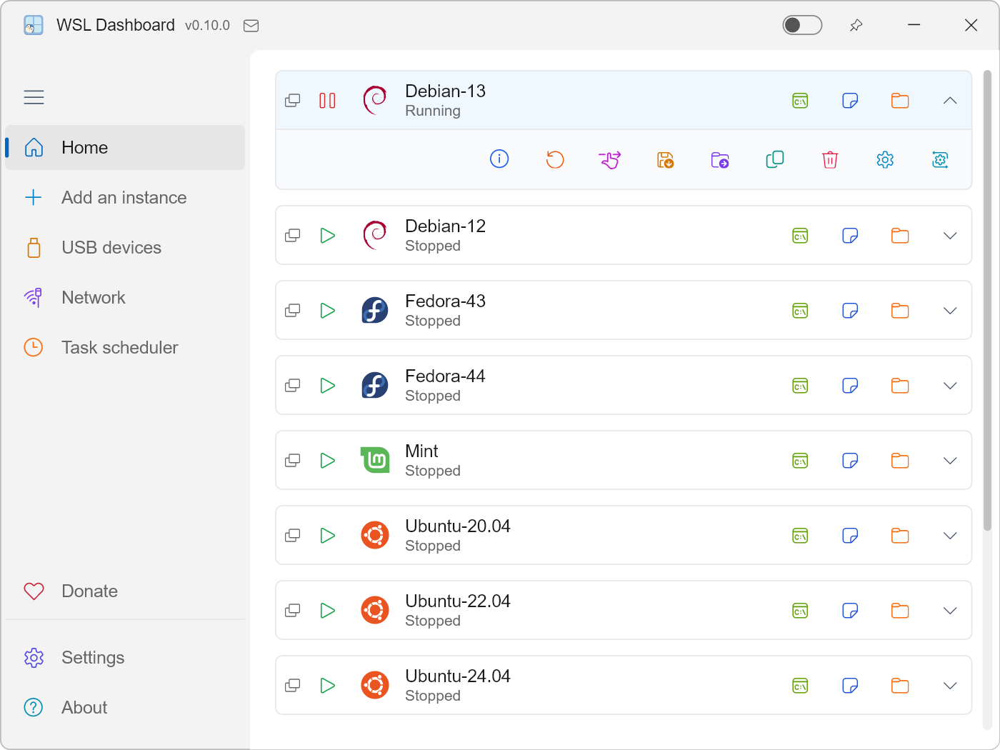
  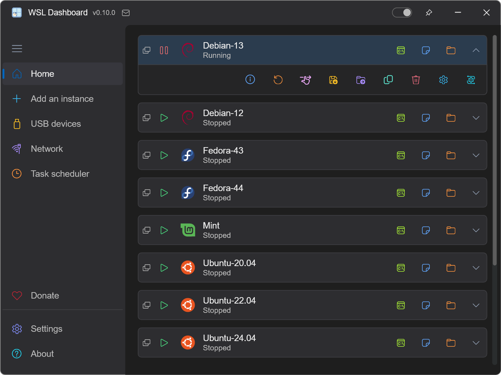
</p>

<p align="center">
  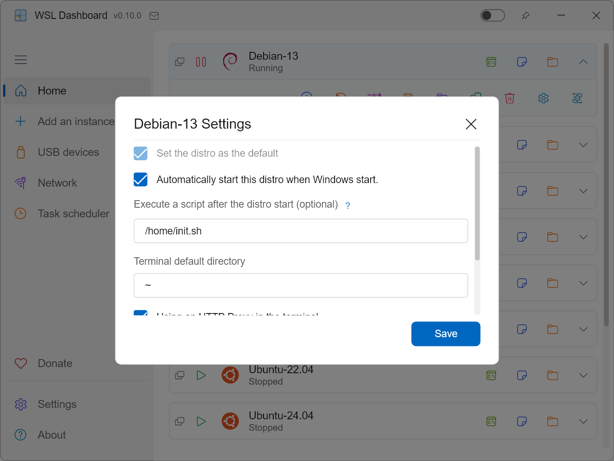
  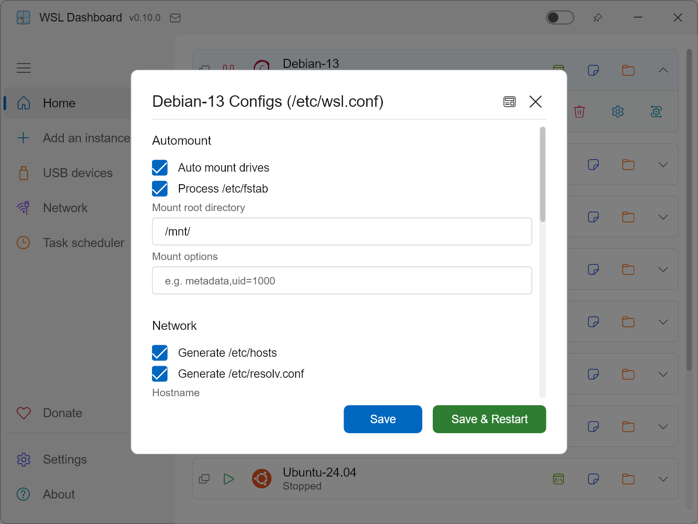
</p>

### USB & Menu Collapse
<p align="center">
  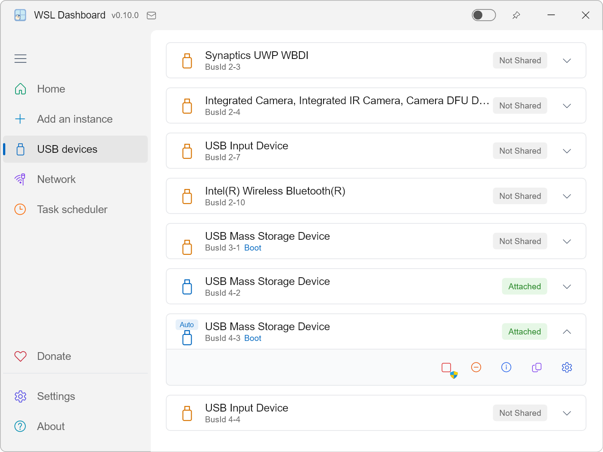
  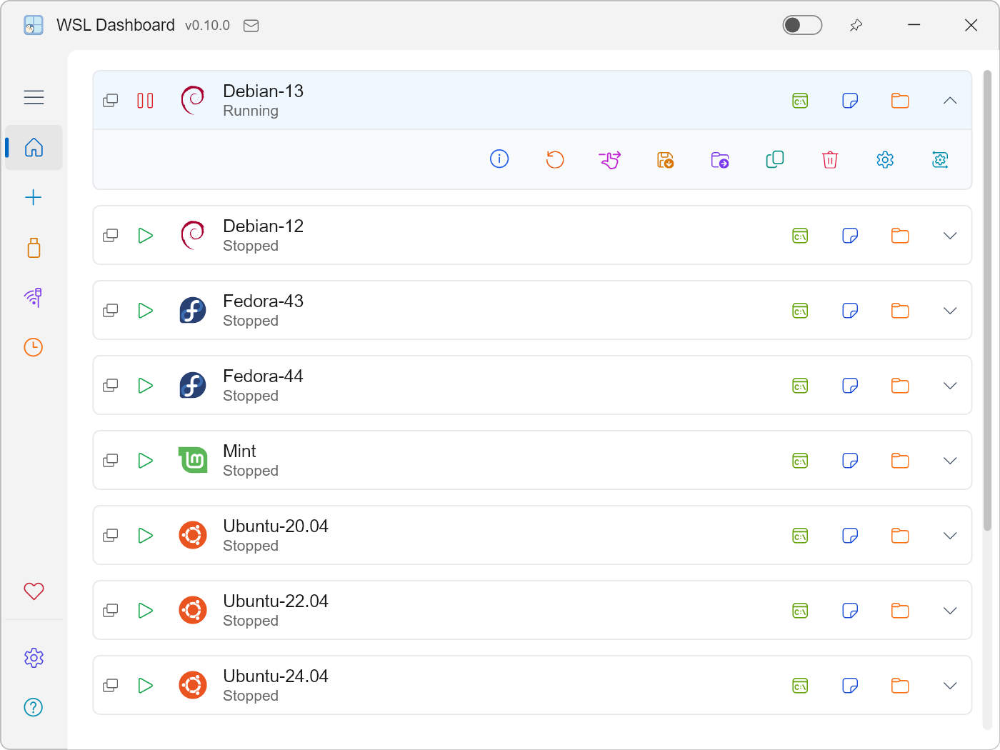
</p>

### Network Management
<p align="center">
  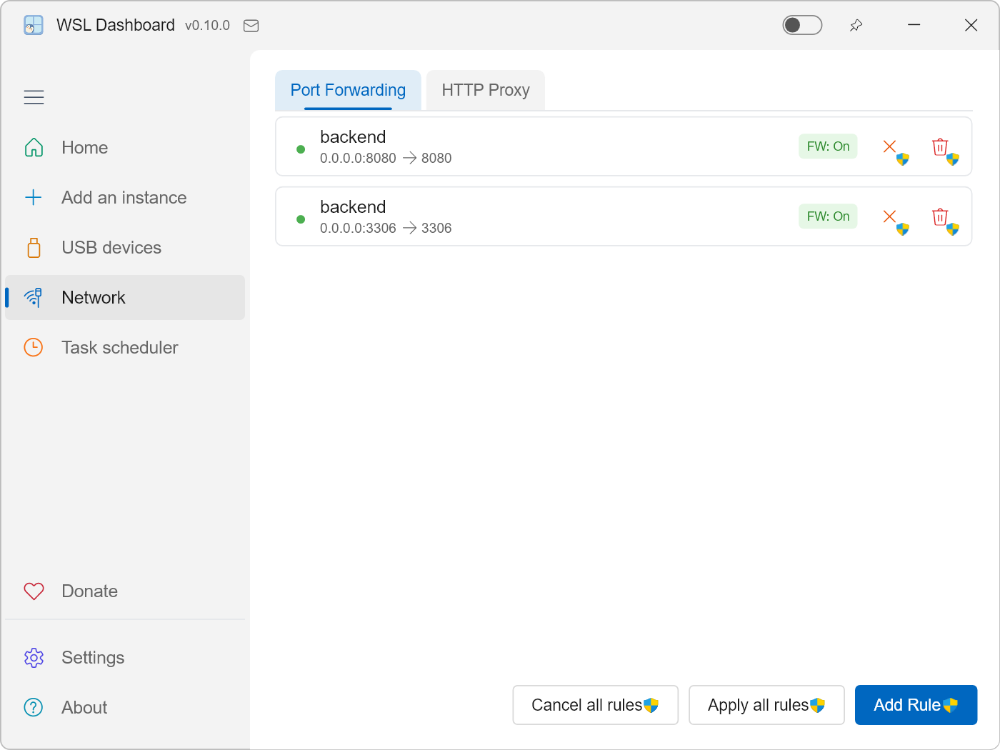
  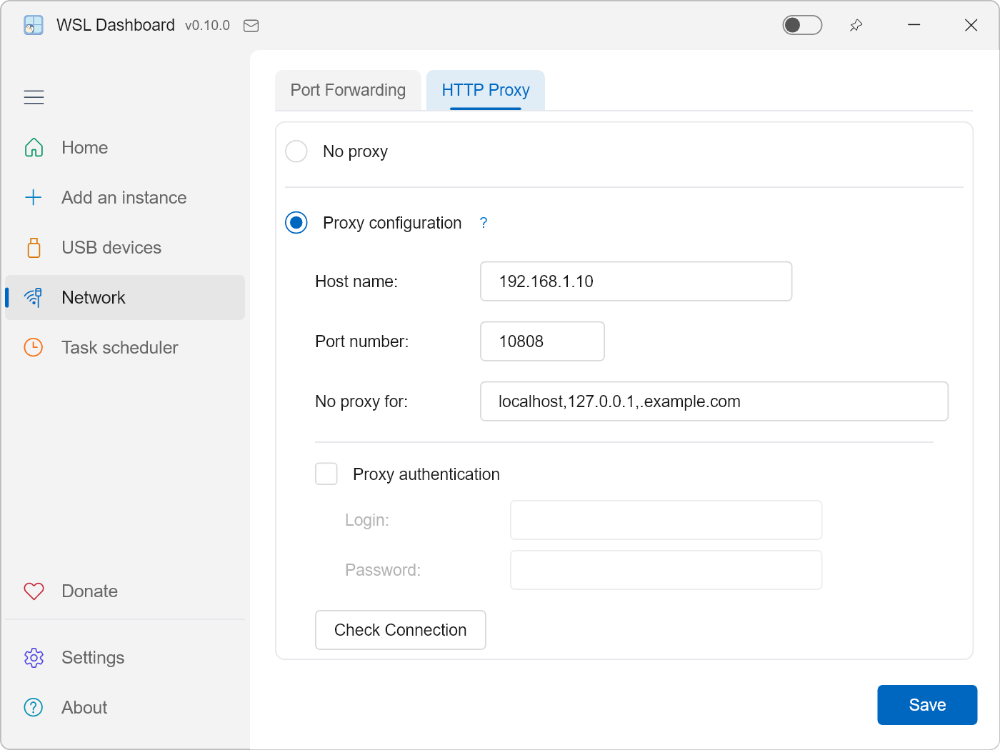
</p>

### Add Instance & Settings
<p align="center">
  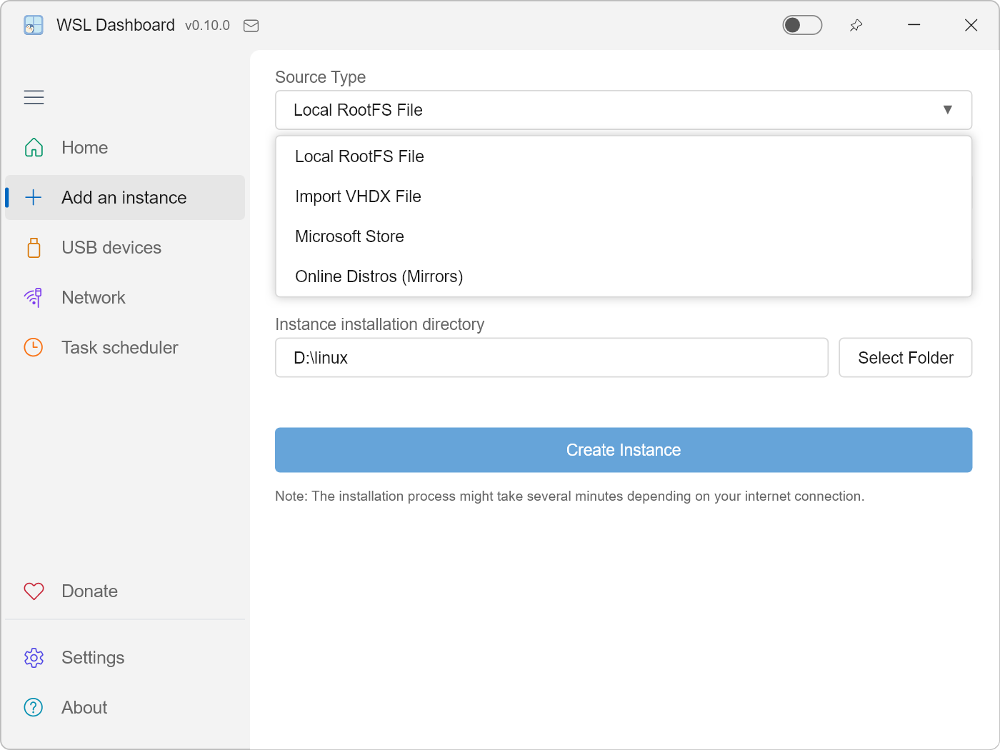
  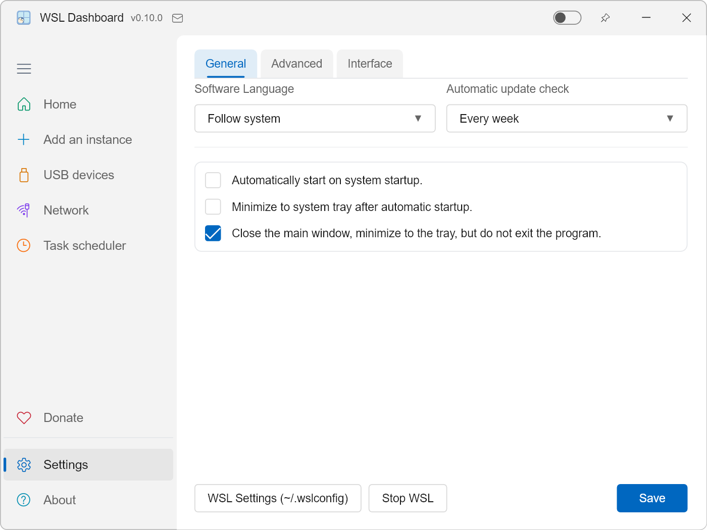
</p>
<p align="center">
  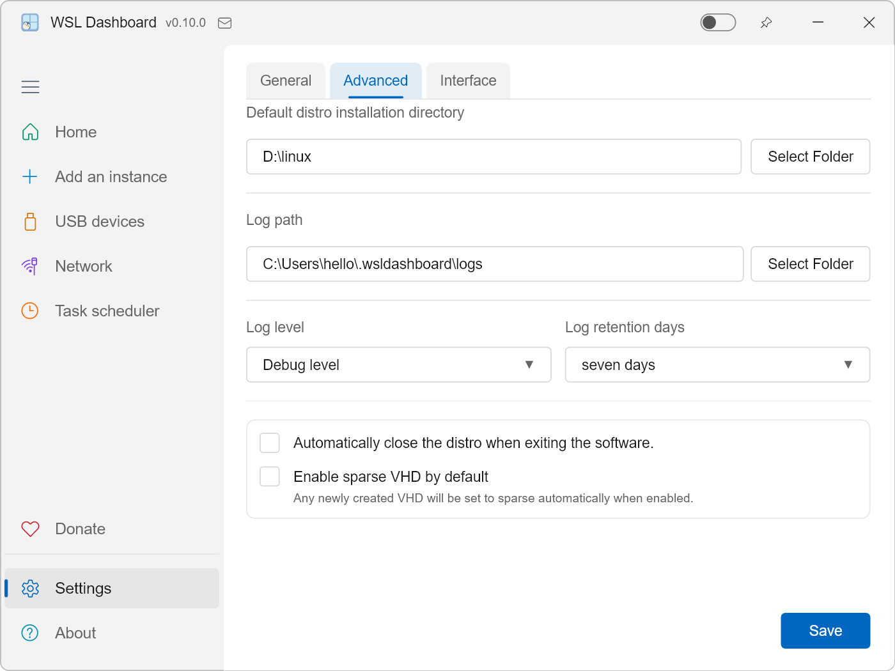
  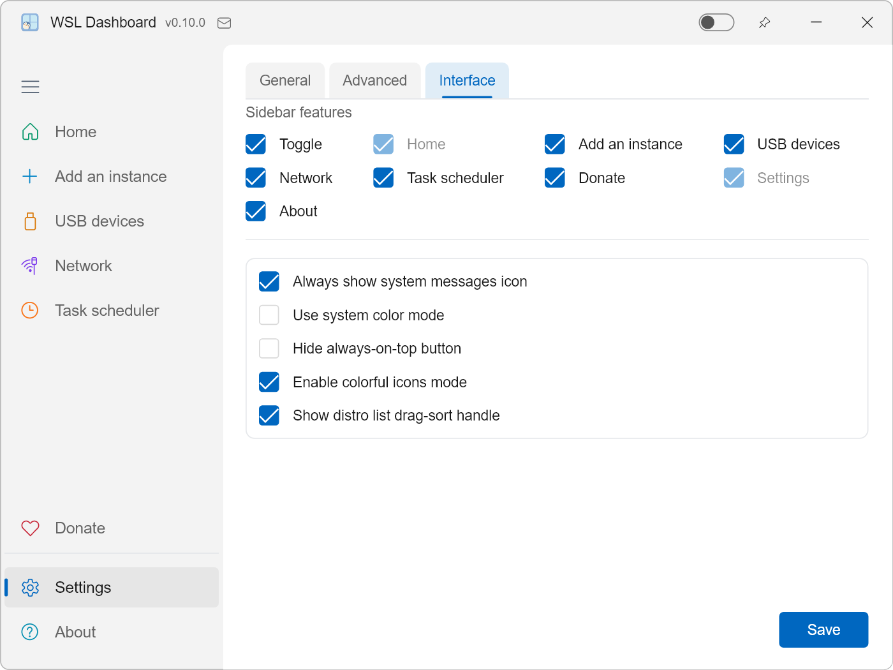
</p>

### About & Donate
<p align="center">
  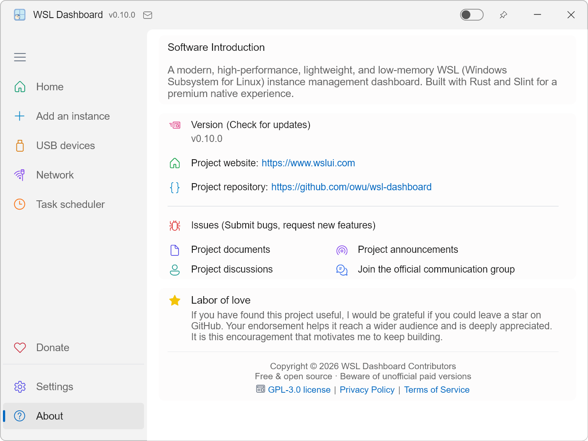
  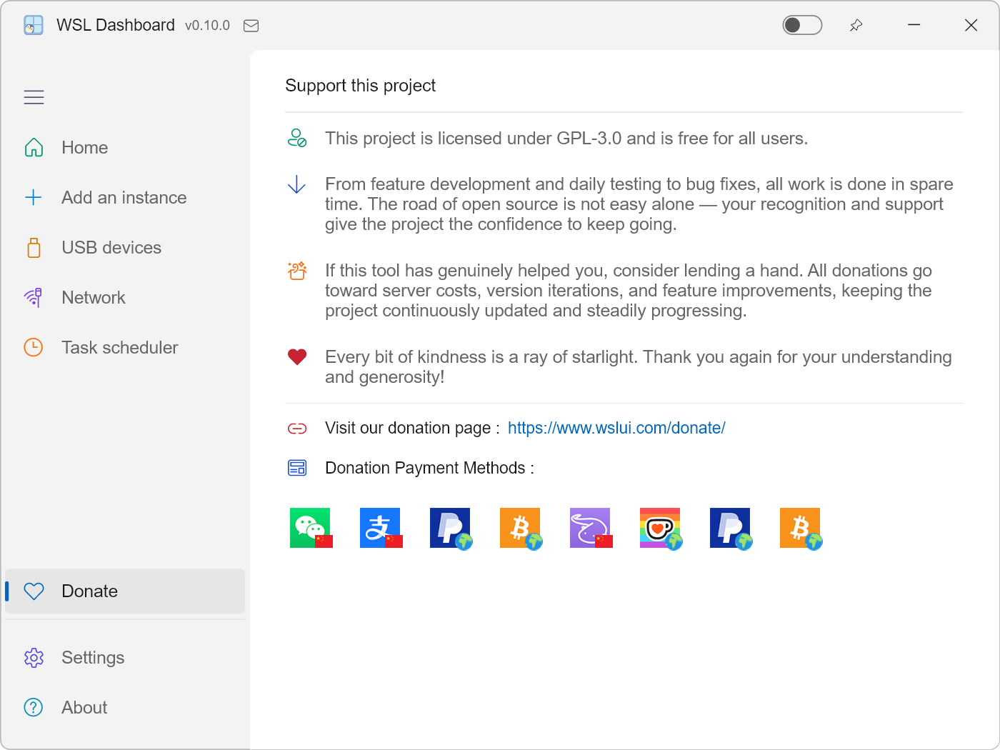
</p>

## 🎬 Demo sa Operasyon

[Tabangi kami nga mapalambo! Tan-awa ang among introduction video ug isulti ang imong hunahuna.](https://github.com/owu/wsl-dashboard/discussions/9)


## 💻 Mga Kinahanglanon sa Sistema

- Windows 10 o Windows 11 nga adunay gipagana nga WSL (girekomenda ang paggamit sa WSL 2).
- Labing menos usa ka WSL distro ang gi-install, o adunay katungod sa pag-install sa bag-ong distro.
- 64-bit CPU; girekomenda ang 4 GB o labaw pa nga RAM alang sa hapsay nga multi-distro nga paggamit.

## 📦 Giya sa Pag-install

### Paagi 1: Bisitaha ang website sa proyekto (Girekomenda)

Girekomenda namon ang pagbisita sa opisyal nga website aron mag-download, tungod kay naghatag kini daghang mga mirror link para sa mas hapsay nga kasinatian:

Adto sa [Download page](https://www.wslui.com/download/) ug pilia ang mirror nga angay sa imong rehiyon.

### Paagi 2: Pag-install pinaagi sa winget

Mahimo nimong i-install ang WSLDashboard direkta gikan sa Windows Package Manager (winget), gamit ang moniker o ang tibuok nga package identifier:

```powershell
# Search (case-insensitive)
winget search wsl-dashboard
# or
winget search WSLDashboard

# Install (pick one)
winget install wsl-dashboard
# or
winget install Owu.WSLDashboard
```

> Ang winget package identifier kay `Owu.WSLDashboard` ug ang moniker kay `wsl-dashboard` (case-insensitive). Bisan asa, molihok.

Para sa dugang impormasyon, bisitaha ang [WinGet community repository](https://github.com/microsoft/winget-pkgs/tree/master/manifests/o/Owu/WSLDashboard).

### Paagi 3: Pag-download sa Pre-compiled Binary

Ang labing sayon nga paagi mao ang paggamit sa gipangandam nga bersyon:

1. Adto sa [GitHub Releases](https://github.com/owu/wsl-dashboard/releases) page.
2. I-download ang pinakabag-ong `wsldashboard` executable alang sa Windows.
3. I-extract (kung compressed file) ug i-run ang `wsldashboard.exe`.

Walay kinahanglan nga pag-install, kini nga app usa ka single-file portable program.

### Paagi 4: Pag-build gikan sa Source

Siguruha nga ang Rust toolchain gi-install (Rust 1.92+ o mas bag-ong bersyon).

1. I-clone ang repository:

   ```powershell
   git clone https://github.com/owu/wsl-dashboard.git
   cd wsl-dashboard
   ```

2. I-build ug i-run:

   - Development debug:

     ```powershell
     cargo run
     ```
   - I-build ang optimized release version gamit ang build script:

     > Ang build script nagkinahanglan sa `x86_64-pc-windows-msvc` toolchain.

     ```powershell
     .\build\portable\build.ps1
     ```


## 🛠️ Tech Stack ug Performance

- **Kernel**: Gipatuman gamit ang Rust, nagsiguro sa memory safety ug zero-cost abstraction.
- **UI Framework**: Slint nga adunay high-performance **Skia** rendering backend.
- **Asynchronous Runtime**: Tokio, alang sa non-blocking system commands ug I/O.
- **Performance Highlights**:
  - **Speed sa Pagtubol**: Halos instant nga pag-start, ug real-time nga pag-monitor sa WSL status.
  - **Resource Efficiency**: Grabe ka ubos nga resource usage (tan-awa ang mga detalye sa [Panguna nga Bahin](#-mga-panguna-nga-bahin-ug-paggamit)).
  - **Portability**: Ang optimized release version nagmugna ug usa ka compact executable file.


## 🤝 Pagsuporta sa Komunidad

Dako among pasalamat sa pagsuporta sa mosunod nga mga komunidad:

- [Rust Programming Language](https://www.rust-lang.org) - Gamhanan ug luwas nga programming language
- [Slint | Declarative GUI for Rust, C++, JavaScript & Python](https://slint.dev) - Modernong UI framework
- [WSL: Windows Subsystem for Linux](https://github.com/microsoft/WSL) - Maayo kaayo nga Windows Subsystem for Linux
- [Tokio - An asynchronous Rust runtime](https://tokio.rs) - Episyente nga asynchronous runtime
- [Windows Developer Community](https://developer.microsoft.com/en-us/windows/community) - Padayon nga pag-uswag sa platform
- [Reddit](https://www.reddit.com) - Global nga diskusyon ug pagsuporta sa komunidad
- [Hacker News](https://news.ycombinator.com) - Global nga diskusyon ug pagsuporta sa komunidad
- [Linux.do](https://linux.do) - Sikat nga komunidad alang sa mga IT professionals
- [V2EX](https://www.v2ex.com) - Diskusyon sa Chinese tech community

Ang imong kontribusyon ug feedback nagpahimo niini nga proyekto!


## ❤️ Suportaha Kini nga Proyekto

- Kini nga proyekto naggamit sa GPL-3.0 open source license, libre alang sa tanan nga users.
- Gikan sa feature development, adlaw-adlaw nga testing, hangtod sa bug fixes, tanan nga trabaho gikan sa libre nga oras. Ang open source nga dalan lisud mag-inusara, ang imong pag-ila ug pagsuporta mao ang pwersa aron ang proyekto magpadayon.
- Kung gibati nimo nga kini nga himan nakatabang kanimo, ayaw pagpanuko sa pagtabang. Ang tanan nga donasyon gamiton alang sa server costs, version iteration, ug feature optimization.
- Gamay nga kaayo, mga bitoon. Salamat pag-usab sa imong pagsabot ug pagkamapinanggaron!

Bisitaha ang among donasyon nga pahina: [https://www.wslui.com/donate/](https://www.wslui.com/donate/)


## ⭐️ Alang sa Gugma

Kung gibati nimo nga kini nga proyekto nakatabang kanimo, mapasalamaton ko kung mahimo nimong hatagan ug star sa GitHub. Ang imong pag-ila makatabang sa proyekto nga maabot ang mas daghang users. Kini nga pagdasig mao ang nagpadala kanako nga magpadayon.


## 📄 Lisensya sa Open Source

Kini nga proyekto lisensyado sa ilalim sa GPL-3.0 – tan-awa ang file sa [LICENSE](../LICENSE) alang sa mga detalye.


---

Built with ❤️ for the WSL Community.